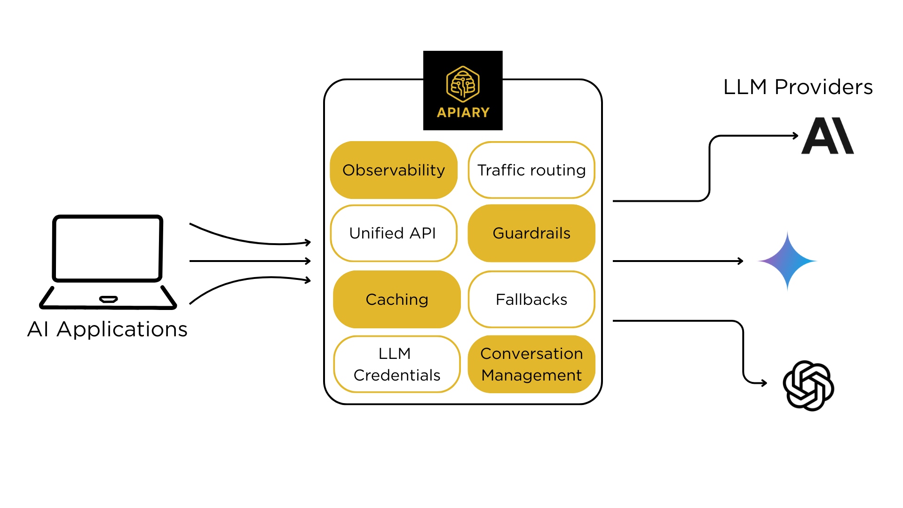
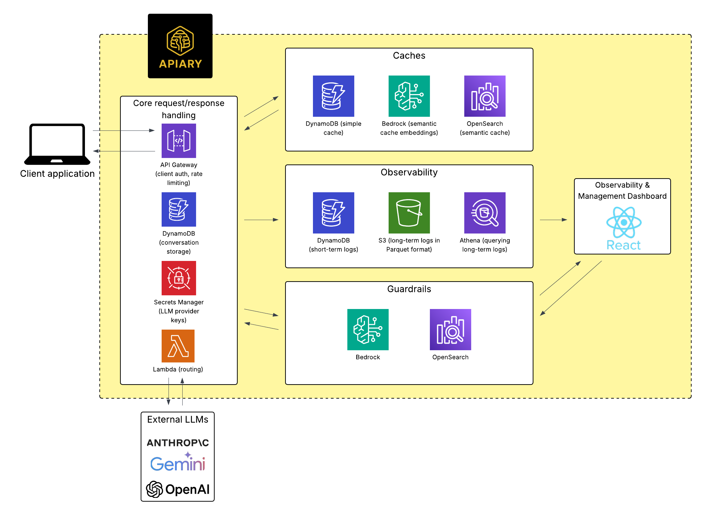

  

# Overview
Apiary is an open-source LLM Gateway for managing requests across leading providers.
It routes all LLM requests through a single API endpoint, simplifying access to multiple models with a unified API, centralized management of features like routing, caching, and guardrails, and built-in observability. 

  

Apiary includes pre-configured serverless infrastructure that can be deployed with minimal setup.
It runs entirely within your own AWS account, ensuring full control over your data.

  

To learn more about Apiary, please refer to our in-depth [case study](https://apiary-gateway.github.io/).

## How to Get Started
1. **Provision Your Infrastructure** - Apiary's CLI tool facilitates easy deployment of its AWS infrastructure. Follow the setup instructions in our [installation guide](https://github.com/Apiary-gateway/cli). 
2. **Send LLM Requests** - Use [Apiary's SDK](https://github.com/Apiary-gateway/clientSDK) in your applications to easily send client requests to multiple LLM providers. 

For a detailed dive into the Apiary app, please read our [case study](https://apiary-gateway.github.io/).

